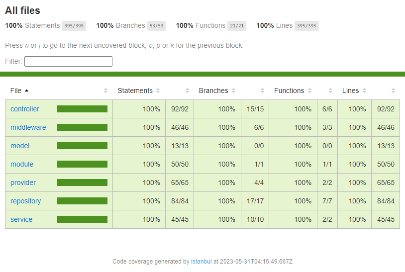

# customer-api

Example REST CRUD API using NestJS + TypeScript + Redis with Keycloak token validation

# Table of Contents

- [Development environment](#development)
  - [Requirements](#requirements)
  - [Initial setup](#setup)
  - [Running locally](#running)
  - [Tests](#tests)
- [Building](#building)
  - [Building with Docker](#docker)
- [Coding](#coding)
  - [Adding new models & repositories](#models--repositories)

# Development
## Requirements
    • NodeJS - minimum required version is 16
    • Docker (optional for building & emulating Redis)
## Setup
First install all required dependencies:
```console
npm i
```
Next, configure all required environment variables as described at [.env.example](.env.example) and save it to a file named `.env`

## Running
Run locally with the following command:
```console
npm run dev
```
## Tests
To run unit & e2e tests, run the following command:
```console
npm run test
```

Currently the coverage is at 100%

Once you run the test script, you can check this report at the `coverage` folder
# Building
To transpile the project, run the following command:
```console
npm run build
```

This will trigger TypeScript's build system, all generated output is going to be at the `build` folder
## Docker
Building a Docker production image can be done with the following command:
```console
docker build -t customer-api:latest .
```
And just run it with:
```console
docker run -d -p 3000:3000 customer-api:latest
```

If you kept a copy of `.env` previously configured into the project's folder, the file will be loaded inside the Docker image, and no additional environment configuration is necessary

Alternatively, if you did not configure `.env` while building, or if you wish to override environment variables, you can start a container with the following command:
```console
docker run -d \
    -p 3000:3000 \
    -e KEYCLOAK_ENDPOINT=<YOUR KEYCLOAK ENDPOINT> \
    -e KEYCLOAK_CLIENT_ID=<YOUR KEYCLOAK CLIENT_ID> \
    -e KEYCLOAK_REALM=<YOUR KEYCLOAK REALM NAME> \
    customer-api:latest
```
Note: you can override any environment variable described on `.env.example` with Docker's `-e` flag
# Coding
Some additional coding notes
## Models & Repositories
Adding new data models and loading it on a repository is as simple as creating 2 files, and injecting the repository into any NestJS module.

First, create your model inside the [src/model](src/model), name it whatever you want, just keep in mind that it needs to be a `class`
```typescript
// src/model/product.model.ts
export class Product {

    name!: string;

    price!: number;

}
```

Now, to create a repository to our model, create a file at [src/repository](src/repository) and extend the `AbstractRepository<T>` class, annotate it with `@Injectable()`, and set the value of `prefix`, usually the model's name but in lowercase
```typescript
// src/repository/product.repository.ts
import { Injectable } from "@nestjs/common";

import { AbstractRepository } from "./abstract.repository";
import type { Product } from "../model/product.model";

@Injectable()
export class ProductRepository extends AbstractRepository<Product> {
    protected override readonly prefix = 'product';
}
```
That's it! Now you can do CRUD operations on your model once you inject this repository on any NestJS module/controller
```typescript
// src/module/example.module.ts
import { Module } from "@nestjs/common";

import { ProductRepository } from "../repository/product.repository";

@Module({
    providers: [ProductRepository],
})
export class ExampleModule { }
```
```typescript
// src/controller/example.controller.ts
import { Controller, Inject } from "@nestjs/common";

import { ProductRepository } from "../repository/product.repository";

@Controller('/example')
export class ExampleController {

    constructor(
        @Inject(ProductRepository)
        private readonly products: ProductRepository,
    ) { }

}
```
